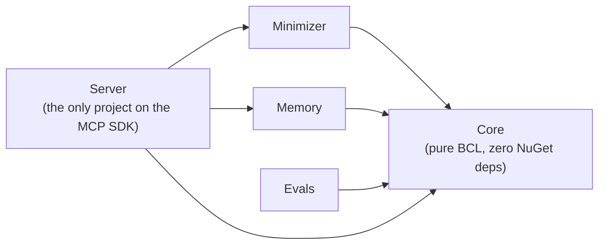

# Architecture

A curated look at the engineering behind Sankshep — the design decisions and the boundaries that keep it
fast, private, and maintainable. (The product source is private; this is the architecture story, not the
implementation.)

## The three-layer model

Sankshep lives entirely in the **tools** layer of the MCP world. The **client** (Copilot, Claude Code,
Cursor…) orchestrates; the **model** reasons; Sankshep — a tool server — does the actual work of
retrieving and minimizing context. Because it speaks the standard protocol, **one build works across
every MCP client and model**. It exposes **eight MCP tools plus one prompt primitive** — the full
surface is documented in the [Tool reference](tool-reference.md). See [How it works](how-it-works.md)
for the full picture.

## Local-first, zero-egress by default

The load-bearing product promise: **local-only, no repo content or telemetry leaves your machine by
default.** The one outbound exception is a one-time, checksum-verified download of the public embedding
model on the first `index_repo`/`search_code` (no repo content is sent) — disableable for air-gapped use
with `SANKSHEP_MODEL_OFFLINE=1` + `SANKSHEP_MODEL_DIR`.

- Embeddings run on-device (ONNX Runtime); vector search is `sqlite-vec` with a pure-C# fallback.
- Your code is embedded and searched on your own machine; only the small, relevant slice reaches the
  model.
- Every telemetry / fleet feature is **opt-in**, exports **counts plus a low-cardinality repo tag (the
  folder name) and optional operator-set labels** (never code, file paths, or queries), and targets a
  **collector you control**. There is a test that asserts zero outbound until you opt in.

## One binary, two transports

The same executable serves **stdio** (the individual-developer default, unchanged and never regressed)
and **Streamable HTTP** (for services and containers), chosen at startup. Everything additive — HTTP,
Docker, services, Kubernetes, auth — is off the stdio hot path.

## The dependency fence

The codebase enforces a strict, one-directional dependency graph, and a build-time test guards it:

- **`Core`** holds shared contracts and has **zero non-BCL references** — a unit test fails the build if
  anything leaks in.
- **`Minimizer` / `Memory` / `Evals`** reference only `Core`.
- **`Server`** is the *only* project that references the MCP SDK; **nothing references `Server`**.

The payoff: the engine (minimization, memory, the prompt composer) stays testable and MCP-agnostic; the
protocol adapter is confined to one project.

## Key technical bets

- **tree-sitter over a language-specific parser** — one incremental, multi-language parsing engine for
  AST-aware minimization.
- **local ONNX embeddings over a cloud API** — offline, private, no per-query network or cost.
- **`sqlite-vec` over a vector database** — a single embedded file, no service to run, with a pure-C#
  brute-force fallback.
- **working-tree-as-truth freshness** — the index tracks your actual working tree (watcher +
  verify-on-read + branch-aware re-index), so answers reflect what's on disk now.
- **evals drive the real server as a subprocess** — the benchmark harness treats the shipped binary as a
  black box over MCP, so what's measured is what ships.

## The prompt composer boundary

The [composer](composer.md) is **deterministic assembly, not generation**: it produces a prompt, never
an answer, and takes **no dependency on any model client** — a boundary enforced by a build-time test.
The composition engine lives in pure-BCL `Core`; only the thin MCP prompt handler lives in `Server`.

## Quality is a number, not a claim

Savings and quality are **measured** by an eval harness (LLM-as-judge key-point recall + token
accounting), not asserted. See [Benchmarks](benchmarks.md).
