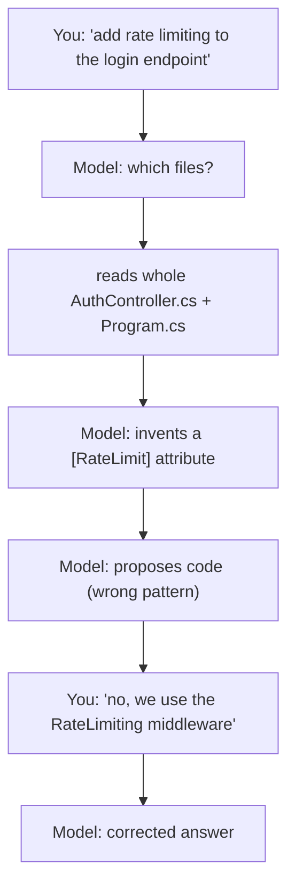
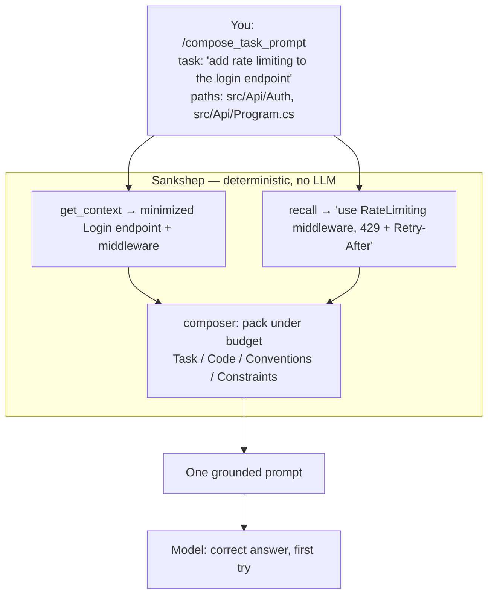
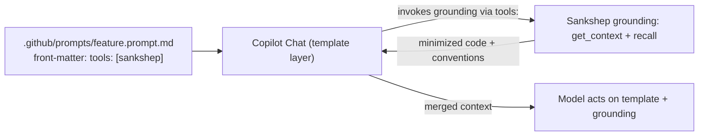

# The prompt composer

*Grounding any coding prompt in minimized code context + remembered project decisions — in one shot.*

`compose_task_prompt` is an MCP **prompt** that, given a task description, assembles a single grounded,
well-structured prompt by combining two things Sankshep already produces: **relevance-ranked,
AST-minimized code** (via `get_context`) and **remembered project conventions** (via `recall`). It
returns that prompt in **one shot**, for the model to act on.

The framing that governs this whole page: **the composer grounds a prompt in minimized-context + memory
— it does not *generate* the prompt's intent, and it never generates the answer.**

**Three benefits, all measurable (see [Benchmarks](benchmarks.md)):**

1. **Fewer roundtrips** — a grounded first prompt removes the "let me look around the codebase first"
   exploration turns; each eliminated turn saves a whole prompt's worth of tokens.
2. **Higher accuracy** — grounding in the *actual* code and conventions stops the model inventing
   patterns the project doesn't use.
3. **Less token waste** — minimized context instead of whole files, and no wasted exploratory turns.

## Positioning vs. GitHub Copilot prompt files

"Isn't this just Copilot's `.prompt.md` files?" No — they operate at different layers and **compose**.
Copilot prompt files are the **template layer** (author-time, static). Sankshep is the **grounding
layer** (request-time, dynamic).

| | **Copilot prompt files** (`.prompt.md`) | **Sankshep composer** (`compose_task_prompt`) |
|---|---|---|
| **Who writes the body** | You, at author-time (a reusable template) | Assembled at request-time from your one-line task |
| **Where code context comes from** | Placeholders / `#file` / untuned `@workspace` | Relevance-ranked, **AST-minimized** code from `get_context` |
| **Where conventions come from** | A hand-maintained `copilot-instructions.md` | **Cross-session `recall`** memory |
| **Static vs. dynamic** | Static until you edit the file | Dynamic — reflects the code + memory *now* |
| **Layer** | Template layer (the prompt's shape) | Grounding layer (the prompt's substance) |

A Copilot `.prompt.md` can *call* Sankshep's grounding tools via its `tools:` front-matter, and Copilot
merges the result into its context. Sankshep does **not** reinvent the template/slash-command layer.

## The naive flow it replaces

Without grounding, an assistant discovers the codebase by *spending roundtrips* — asking for files,
reading too much, guessing conventions, correcting itself:



## The composed one-shot flow

The composer collapses that exploration into a single deterministic assembly step *before* the model
reasons:



## Interop: a Copilot prompt file calling Sankshep



## Anatomy of a composed prompt

Four labelled sections, assembled deterministically under a token budget split between code and
conventions:

- **Task** — your one-line intent, verbatim.
- **Relevant code** — AST-minimized, ranked snippets from `get_context`, each with its file path.
- **Project conventions** — remembered decisions from `recall`, branch-scoped, deduped, most-recent-first.
- **Constraints** — guardrails (stay within the shown code, don't add dependencies, follow conventions).

**Worked example — "add rate limiting to the login endpoint":**

```text
# Task
add rate limiting to the login endpoint

# Relevant code (minimized)
// src/Api/Auth/AuthController.cs:42-58 Login
[HttpPost("login")]
public async Task<IResult> Login(LoginRequest req, CancellationToken ct) { /* … issues JWT … */ }

// src/Api/Program.cs:18-24
builder.Services.AddRateLimiter(/* … existing FixedWindow limiter … */);
app.UseRateLimiter();

# Project conventions
- Rate limiting uses ASP.NET's built-in RateLimiting middleware, never a custom attribute.
- Limits are bound from RateLimitingOptions in appsettings, not hard-coded.
- Throttled requests return 429 with a Retry-After header.

# Constraints
- Work within the code shown above; do not invent new packages or patterns.
- Follow the recalled conventions exactly. If information is missing, say so rather than guessing.
```

The model receives that — grounded, minimized, convention-correct — so its first response uses the
middleware pattern and the 429/Retry-After contract, with no exploratory roundtrips.

## The boundary: a prompt, not an answer

The composer is **deterministic assembly of retrieved material**. It **does not** generate code, call an
LLM, or orchestrate a solution — and it takes **no dependency on any model client** (a build-time test
enforces this, so the boundary can't erode). Given fixed inputs it produces byte-identical output: the
*retrieved* material (Relevant code / Project conventions) traces back to `get_context` / `recall`, while
Task is your input verbatim and Constraints are fixed guardrails — so the whole prompt is deterministic and
auditable.

## Using it

!!! note "Arguments"
    `compose_task_prompt` takes **`task`** (your one-line intent) and **`paths`** — the file or directory
    paths to draw code context from, comma- or newline-separated. `paths` is **required**; with none
    supplied there is no code to minimize and the Relevant code section comes back empty. **`tokenBudget`**
    is optional and defaults to **4000**, split between code and conventions.

- **As Sankshep's MCP prompt:** clients that surface prompts expose `compose_task_prompt` as a
  slash-command — supply the task and the paths, get the grounded prompt.
- **Under a Copilot prompt file:** a committed `.github/prompts/*.prompt.md` references Sankshep's
  grounding tools via `tools:`, and Copilot merges the result — the template layer calling the grounding
  layer.
