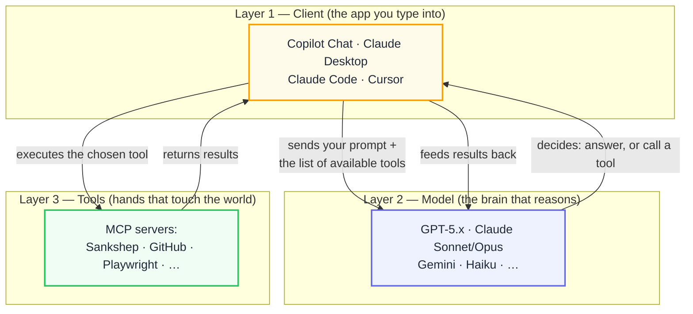
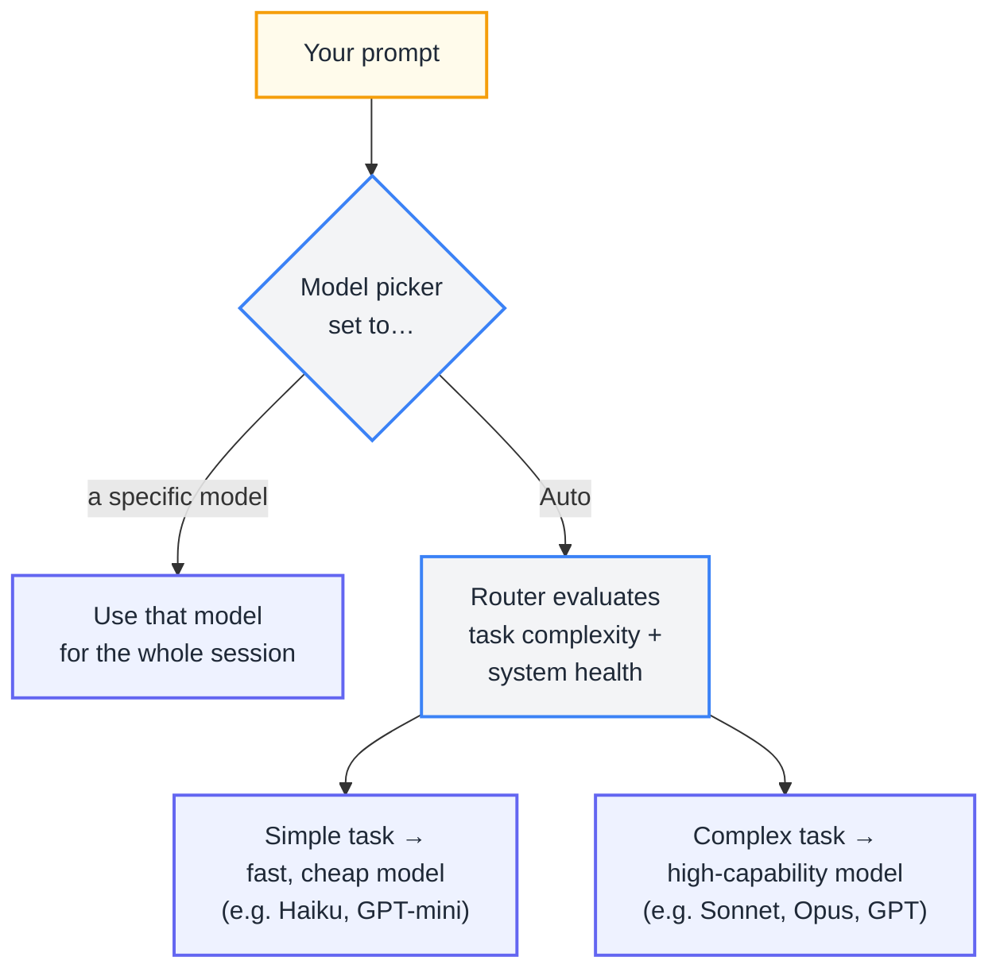
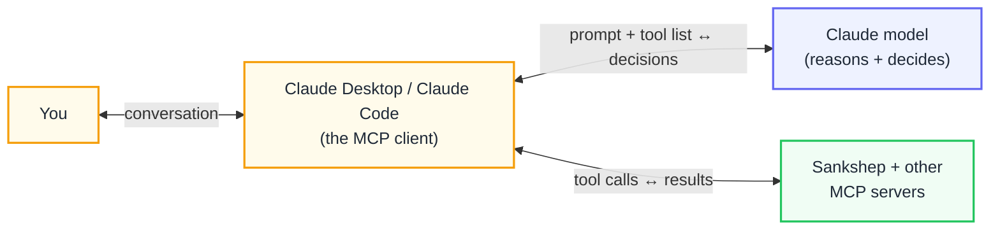
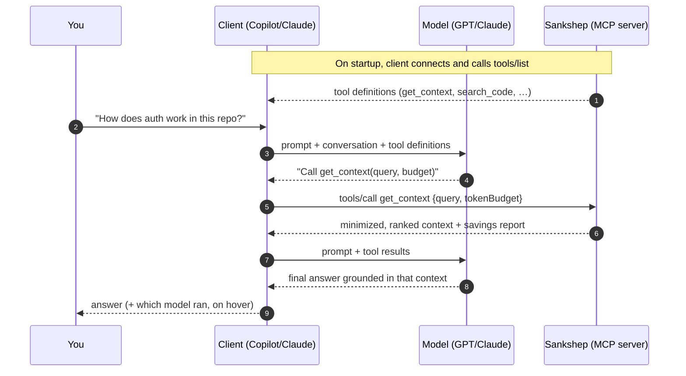
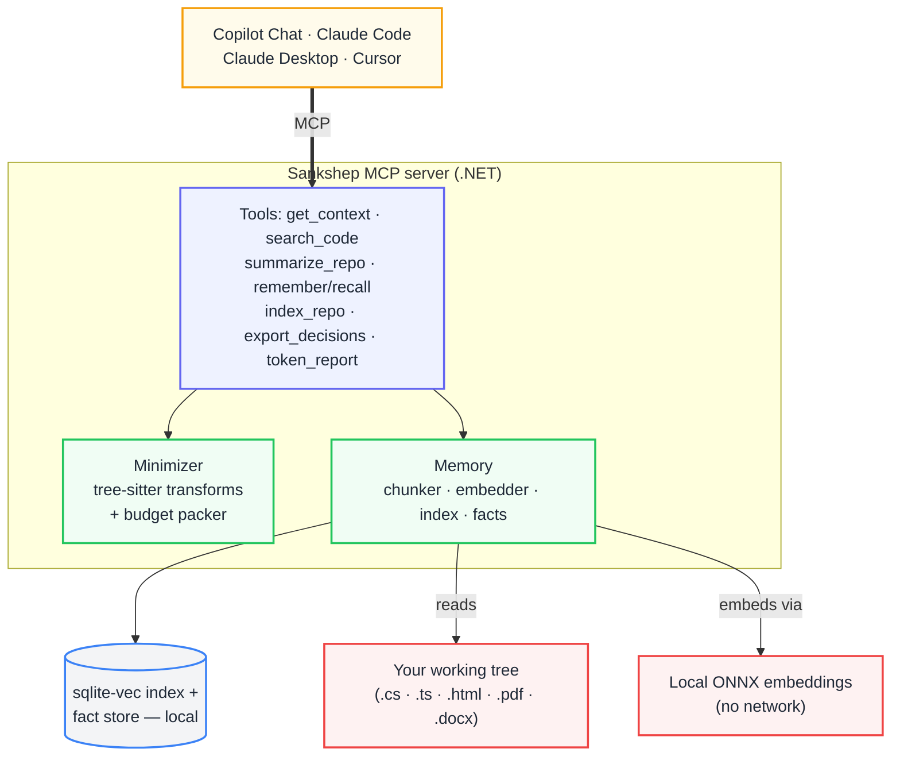
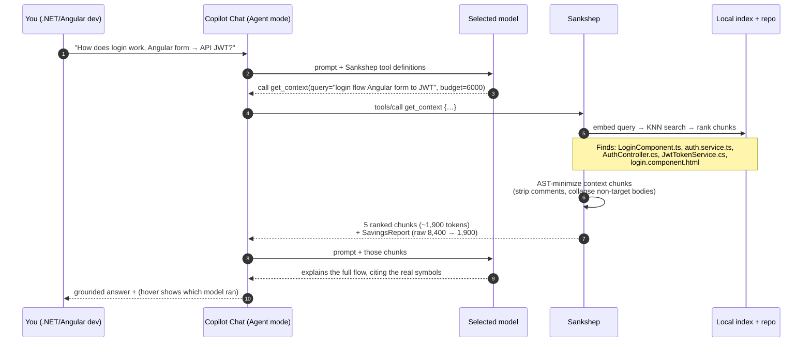
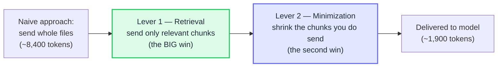

# How Sankshep Works With AI Assistants

*A guide to models, GitHub Copilot Chat, Claude AI, and the Model Context Protocol — and where Sankshep fits.*

---

## Table of contents

1. [The mental model: three layers](#1-the-mental-model-three-layers)
2. [How different models work through GitHub Copilot Chat](#2-how-different-models-work-through-github-copilot-chat)
3. [How Claude AI chat works](#3-how-claude-ai-chat-works)
4. [What MCP is, and why the model never talks to your code directly](#4-what-mcp-is-and-why-the-model-never-talks-to-your-code-directly)
5. [How Sankshep fits in](#5-how-sankshep-fits-in)
6. [End-to-end worked example](#6-end-to-end-worked-example)
7. [Why this design saves tokens](#7-why-this-design-saves-tokens)

---

## 1. The mental model: three layers

The single most important idea in this whole document: **the model, the client, and the tools are three separate layers.** People conflate them ("Copilot is GPT," "Claude is the chat window"), and that confusion makes MCP hard to understand. Keep them apart:



- **The client** is the harness. It owns the conversation, the system prompt, and the connections to tools. It does *not* reason — it orchestrates.
- **The model** is swappable. The same client can drive GPT one minute and Claude the next. The model only *reasons* and *decides*; it cannot run anything itself.
- **The tools** are MCP servers. They do the actual work — reading files, querying databases, and (for Sankshep) minimizing and retrieving codebase context.

Sankshep lives entirely in **Layer 3**. It works with *any* Layer 1 client and *any* Layer 2 model, because it speaks the standard protocol between them. That is the whole reason a single Sankshep build works in Copilot Chat, Claude Code, Claude Desktop, and Cursor simultaneously.

---

## 2. How different models work through GitHub Copilot Chat

GitHub Copilot is **not a model** — it is a client (Layer 1) that lets you choose which model (Layer 2) powers your chat. In Copilot Chat there's an explicit model picker; the currently exposed shelf includes OpenAI GPT models, Anthropic Claude Sonnet, and Google Gemini variants.

### The model picker

At the bottom of the Copilot Chat input, a dropdown lets you switch the active model. Copilot allows you to change the model during a chat and have the alternative model used to generate responses to your prompts. A few important behaviors:

- Changing the model used by Copilot Chat does not affect the model used for Copilot inline suggestions — the grey autocomplete ghost text is a separate, admin-configured model you cannot pick.
- On some plans the picker is hidden: if you don't see a picker, you're likely on a Free or Pro tier with a fixed default.
- The model list changes constantly — providers add and retire models every few weeks — so treat any specific model name as a snapshot in time.

### Auto mode (task-based routing)

Instead of picking manually, you can choose **Auto**, which turns Copilot into a routing layer. Auto model selection combines two systems to provide high quality results and better reliability: one system tracks real-time system health and availability, while the other evaluates task complexity. Putting these together, auto model selection routes the task to the optimal model. With auto, Copilot chooses a model on your behalf based on the complexity of your request and current model availability, which allows you to better optimize for token use while maintaining high quality results.

You can always see what actually ran: you can see which model was used by hovering over the model response. One efficiency note — routing occurs along natural cache boundaries to avoid additional cache-related costs, because switching models mid-session has shown increased cost without ample improvements in quality.



### Two different pickers (a common gotcha)

Copilot has **two** separate model selectors that do not sync:

| Surface | Where you pick | Notes |
|---|---|---|
| **Chat / Agent mode (in your IDE)** | Bottom of the chat input | Resets to a default each new session; Agent mode reuses the Chat selection |
| **Coding Agent (cloud, async)** | GitHub web UI when starting a task | The Copilot Coding Agent runs independently in GitHub's cloud; you select a model in the web UI when you start the task, but it doesn't use the model you selected in your IDE. |

For Sankshep, the surface that matters is **Agent mode in the IDE**, because MCP tools only fire there (explained in §4).

---

## 3. How Claude AI chat works

"Claude AI chat" comes in two flavors, and it's worth separating them:

### Claude.ai (the web/desktop chat app)

This is Anthropic's own client (Layer 1) where the model (Layer 2) is always a Claude model. Unlike Copilot, you're not mixing vendors — the picker chooses *which Claude* (e.g., a fast Haiku vs. a powerful Opus), not which company's model. The reasoning loop is the same three-layer pattern: you type, the Claude model reasons over the conversation plus any connected tools, and it either answers or calls a tool.

### Claude Desktop and Claude Code (MCP clients)

These are the versions that matter for Sankshep, because they are full MCP clients. **Claude Desktop** is the desktop chat app with MCP support; **Claude Code** is the agentic command-line/IDE tool. Both connect to MCP servers via a config file and then let the Claude model use those servers' tools during a conversation.



The key symmetry: **from the tool's point of view, Copilot Chat and Claude Desktop are the same thing** — both are MCP clients that discover Sankshep's tools and invoke them on the model's behalf. That's the power of a standard protocol: Sankshep doesn't need to know or care which client or model is on the other end.

---

## 4. What MCP is, and why the model never talks to your code directly

The Model Context Protocol (MCP) is a standard, JSON-RPC-based way for clients to expose **tools** to models. The crucial thing to understand is the division of responsibility — and one fact that surprises people:

> **The MCP server never sends instructions to the model.** The MCP server only provides tool definitions — but never includes actual pre-instructions for the LLM. This is intentional: the system prompt must come from the client who is orchestrating the conversation.

So how does the model "know" to call Sankshep? Through the tool *descriptions*. When agents connect to an MCP server, the tools metadata — an array with names, parameter schemas, and descriptions — becomes vectorized inside the LLM, producing an internal tool embedding for each tool. Later, the LLM uses this semantic signature to infer which tool fits the request. This is why high-quality tool names, descriptions, and parameter descriptions matter so much when building MCP tools.

And to be precise about "deciding": the LLM isn't deciding in the human sense — it's predicting tool-call tokens when they appear appropriate, given the prompt, chat history, tool descriptions, and system guidelines.

### Why this only works in Agent mode

Tool-calling is an *agentic* capability. In Copilot, you access these capabilities by using agent mode; when combined with MCP servers, agent mode becomes significantly more powerful, giving Copilot access to external resources without switching context. This lets Copilot complete agentic "loops," where it can dynamically adapt its approach by autonomously finding relevant information, analyzing feedback, and making informed decisions. Plain "Ask" mode doesn't call tools — so Sankshep's tools simply won't appear there.

### The tool-calling loop



Note that steps 2–9 can repeat: the model can call a tool, see the result, and decide to call another — the "agentic loop." The model orchestrates; Sankshep just answers each call.

---

## 5. How Sankshep fits in

Sankshep is an MCP server (Layer 3) that gives the model **token-minimized, relevance-ranked context** from your codebase, plus **persistent memory** across sessions. It sits between the client and your repository:



Everything runs locally: your code is embedded and searched on your own machine, with no outbound network calls at query time. The model receives only the small, relevant slice Sankshep returns — not your whole repository.

---

## 6. End-to-end worked example

Let's trace a real request for a **.NET + Angular full-stack developer**. Suppose your repo is a typical stack: an ASP.NET Core API plus an Angular front-end, and you ask, in **Copilot Chat (Agent mode)** with the model set to a Claude or GPT model:

> *"How does the login flow work end to end — from the Angular form to the JWT the API issues?"*

Here's what happens, step by step:



### What Sankshep actually returned (illustrative)

Instead of dumping five whole files (~8,400 tokens of raw code, comments, and boilerplate), Sankshep sent a compact, ranked bundle. For the Angular side it kept the relevant method signatures and the specific call that hits the API; for the .NET side it kept the controller action and the token-signing method body (the *target* of the question), while collapsing unrelated methods to signatures:

```csharp
// AuthController.cs  (relevance: 0.94) — target, kept in full
[HttpPost("login")]
public async Task<IActionResult> Login(LoginRequest req) {
    var user = await _users.ValidateAsync(req.Email, req.Password);
    if (user is null) return Unauthorized();
    var token = _jwt.Issue(user);          // ← see JwtTokenService
    return Ok(new { token });
}
```
```typescript
// auth.service.ts  (relevance: 0.91) — target, kept
login(email: string, password: string) {
  return this.http.post<{token: string}>('/api/auth/login', { email, password })
    .pipe(tap(r => this.store.setToken(r.token)));
}
```
```csharp
// JwtTokenService.cs  (relevance: 0.89) — target body kept
public string Issue(User user) {
    var claims = new[] { new Claim(ClaimTypes.NameIdentifier, user.Id) /* … */ };
    // signs with RS256 using the configured signing key
    return new JwtSecurityTokenHandler().WriteToken(/* … */);
}
// Other 11 methods in this class collapsed to signatures — not relevant to login
```

The model now answers with the *complete* end-to-end flow — Angular form submits to `auth.service.ts`, which POSTs to `AuthController.Login`, which validates and calls `JwtTokenService.Issue` to mint an RS256-signed JWT — **without ever seeing the ~6,500 tokens of irrelevant code** that a naive "read all the files" approach would have burned.

### The memory angle

Because Sankshep also has a fact store, you (or the model) can record a decision once and recall it later:

- In Claude Code: *"Remember: we sign JWTs with RS256, keys rotate monthly via the KeyVault job."* → `remember`
- Next week, in Copilot Chat: you ask about token security → the model calls `recall` → the decision surfaces, even though a *different client and model* recorded it.

That cross-client shared memory is an emergent benefit of storing facts in a local database that every client reads.

---

## 7. Why this design saves tokens

Two independent levers reduce token usage, and it helps to see them separately:



- **Lever 1 — Retrieval:** semantic search sends the 5 relevant chunks instead of 40 whole files. This is where most of the practical benefit lives, but Sankshep does **not** report it as tokens saved — sending less is trivially "cheaper", so the number would be unbounded. Whether it picked the *right* 5 is what [recall](benchmarks.md) measures.
- **Lever 2 — Minimization:** AST transforms strip comments and collapse non-target method bodies to signatures, shrinking what remains. This is what `token_report` reports, as **compression**: delivered tokens against the original size of the same files.

The ~8,400-token figure above is a **naive-send baseline** — the five whole files you'd have pasted yourself. That is a fair comparison. It is *not* the same as the tokens Sankshep *searched*, which on a large repository can run to millions and is never treated as a baseline.

For a .NET + Angular stack specifically: **C#/.NET compresses very well** (verbose namespaces, XML docs, attributes, brace-heavy blocks collapse dramatically), while **Angular templates (HTML/SCSS) rely more on retrieval than on minimization** (there are no "method bodies" to collapse in markup). The combined effect on a typical feature-scoped question is a large reduction in delivered tokens — and, because the model wades through less noise, often a *better* answer too.

> **Important:** the exact percentage is repo- and query-dependent, and the honest way to state it is with the eval harness's measured numbers on a named repository, not a marketing figure. The tool is designed so that "how much did we save, and did quality hold?" is a number you *measure and publish*, not one you guess.

---

*Sankshep is a proprietary MCP server, free to install and use. Because it speaks the standard protocol, one build works across GitHub Copilot Chat, Claude Code, Claude Desktop, and Cursor — with whatever model you've selected in each.*
